# BitWisdom AI Network™ — Whitepaper

> A patent-pending, decentralized, fair, collaborative, cooperative worldwide network powered by AI and automation — lowering transaction fees for merchants at scale via cryptocurrency payment gateways with QR-code and Tap-to-Pay support.

**Contact:** admin@bitwisdom.ai | [www.bitwisdom.ai](http://www.bitwisdom.ai)

---

**Abstract.** While modeled after the most popular of cryptocurrencies
\[1\], with a goal toward system decentralization, meaning, the more the
system scales as numerous businesses use the system, the more difficult
it will be for any entity to be able to control it, stop it, shut it
down, or even locate where the system is running from. Each node is a
full crypto payment gateway and as it scales worldwide, this
decentralized system can continue to run in perpetuity and without any
threat of full termination by outside authorities. The system is
designed similarly to major decentralized cryptocurrencies in which the
entire internet everywhere would have to be shut down and be kept shut
down forever for this system to possibly be terminated. In this unlikely
event, also similar to the most popular of cryptocurrencies, it could
still function properly with Meshtastic-type devices and
Bluetooth-enabled ham radios or of course, stationary or mobile
Starlink® \[2\] or similar devices.

At its core, this is a consumer-to-merchant version of almost instant
electronic cash that allows Point of Sale and/or E-Commerce payments for
goods and services to be sent directly from consumer (or customer or
constituent, etc.) to merchant (or institution, or municipality, etc.)
at lowest fees. This is made possible with patent-pending,
fee-optimized, decentralized Artificial Intelligence (AI) technology,
eliminating the need for traditional financial intermediaries. The
responsible use of AI is part of the scalable solution in not only
optimized low-fee final settlement to each merchant's wallet, but AI
also directs each node to perform this function in a collaborative,
cooperative way. For redundancy, while a bit less effective, each node
also has its own fallback-position-low-fee-settlement-function in the
event the decentralized AI is not reachable. If all nodes only used this
locally-running function and there was no collaborative, cooperative
AI-powered network in place, the system could not scale. This is because
ultimately, each node would nullify the low-fee settlement goal of all
nodes because they would all try to settle simultaneously at the
perceived lowest fee, thereby potentially driving fees higher.

Automation is also necessary in a system of this complexity, as it
performs the functions of transaction processing, accounting, liquidity
management, statement/analytics reporting, backup, illicit activity
monitoring and self-healing in the event of an outage. These nodes,
which are each operating as a decentralized crypto payment gateway
service, as well as every decentralized AI server deployed, strengthens
the computing power, decision-making, robustness and redundancy of this
network as well as strengthening blockchain(s). In essence, the more the
system scales, the more it automatically improves. In addition to the
ability to run a node as a VPS, these locally-hosted nodes themselves
require minimal administrator intervention, due to self-healing and
automation technology. An added benefit of running a crypto node is that
this creates a direct connection to the blockchain allowing verification
of transactions and validation of new blocks, eliminating reliance on
third-party providers. Businesses running nodes, including the
merchants, who can also run their own node, can join, leave or rejoin at
will to this network, with no commitment or up-front costs, other than
the Clearnet-and-reporting-required-subscription-services, hardware, and
funds needed for transactional liquidity. Success of this system is only
achieved if there is success of the merchants using the system, which
will also result in consumer purchase satisfaction due to the avoidance
of high-transaction-fee-surcharges.

1.  Introduction

> Point of Sale and E-Commerce transactions have come to rely almost
> exclusively on traditional, centralized financial intermediaries and
> payment gateways serving as fund custodians to process electronic
> payments, while also consuming significant electrical energy. As for
> traditional crypto payment gateways, they require merchants to have a
> website, plus E-Commerce integration, with the technical expertise to
> integrate the payment gateway service into their own systems. These
> costly, technical constraints shut out potentially 98% to 99% of all
> merchants worldwide from accepting crypto online and at Point of Sale
> for everyday transactions. Crypto access is no longer reserved for the
> few, because now every merchant can participate.
>
> While the traditional systems operate adequately enough for most
> digital transactions, consisting of \~85% of all transactions
> worldwide \[3\], they still suffer from high fees, especially during
> high volume traffic times. The consumer and merchant must also trust
> these custodians with their funds. Chargebacks are always a
> possibility, since financial intermediaries and payment gateways
> cannot avoid mediating disputes, thereby eroding trust between parties
> in any transaction. The cost of significant energy usage and
> mediation, combined with high network traffic, increases transaction
> fees as a whole, meaning consumers usually incur a surcharge for
> smaller purchases, because the merchant must pass this fee on. Trust
> between the two is further eroded by not only the possibility of
> consumer chargebacks and fraud, but this causes merchants to have to
> require more information on their consumers because the financial
> intermediaries, who also collect information on the consumers, are
> also needed for mediation. Ideally, it can be argued that mediation
> should be between the merchant and the consumer with no other
> intermediary.
>
> Because in-person cash transactions are inconvenient online and now
> even for Point-of-Sale purchases, there has been a need for a fast,
> low fee, simple QR-code generating electronic payment system without
> the need for a high-fee intermediary and fund custodian. Chargebacks
> should be at the discretion of the merchant, which could mitigate
> fraud and increase trust between the merchant and the consumer.
> Consumers should not have to hand over information to any third party.
> Consumers should not have to carry multiple forms of payment,
> including cash. They already have their phone. There are free
> self-custodial wallets they can download on their phone. Likewise,
> merchants shouldn't need to accept multiple forms of payment.
> Merchants and their employees already have a phone or tablet to accept
> payment by installing and easily configuring various free, mobile
> crypto Point of Sale apps, while adding that soon there will be Point
> of Sale integration with the most popular platforms. There are also
> free self-custodial wallets that merchants can download on their phone
> and PC, including syncing between the two, with backup for redundancy
> and convenience, to accept these consumer payments into their wallet.
> Merchants should be able to onboard to a node in 30 minutes and start
> accepting cryptocurrency from consumers immediately and shouldn't need
> a website with E-Commerce integration. When tailored to integrate into
> systems such as Casino Gaming, Online Gaming, Events, Mobile
> Applications, Subscription Services and Kiosks, this system should be
> able to work at the rapid tempo of today's business. The world's
> people are living in a fast-paced digital age where speed and
> convenience are almost a requirement. Lower transaction fees in this
> age are a plus and are favored by merchants and consumers alike. A
> fair, decentralized, fast, low-fee, highly-available, simple-to-run
> system is essential to fulfill this need.

2.  Transactions

> Double-spend mitigation, timestamp server and proof-of-work
> implementation is now inherent in blockchain technologies. The
> ingenious implementation of off-chain or second-layer protocol (or
> eventually multi-layer protocols) further increases transaction speed,
> decreases fees and eases base-layer blockchain traffic congestion. The
> revolutionary combination of these protocols allows both technologies
> to work in tandem, as it was intended. To elaborate, the system
> supports both base-layer and second-layer protocol transactions from
> wallets that support either/or, and both. Using Mobile Point of Sale
> Terminal apps combined with a uniquely-generated QR-code for consumer
> payments means consumer invoices can be generated by a merchant within
> \~2 seconds using this system. A consumer opening their wallet and
> using tap-to-pay or scanning the merchant's QR-code, verifying amount
> owed and tapping send or pay, can surpass traditional Point of Sale
> and E-Commerce sale experiences in both time savings and simplicity,
> while eliminating the consumer's need to carry multiple forms of
> payment. Eventually, merchants could also eliminate acceptance of
> multiple forms of payment. Settlement between consumer and merchant
> can be almost instantaneous at \~0.1 seconds. With this use of a
> faster second-layer protocol, the most popular of cryptocurrencies
> including the most popular of stablecoins \[4\] are also supported by
> this system. With support for tap-to-pay and the use of cryptocurrency
> cards, such as Bolt \[5\], Coolwallet®\[6\], Arculus®\[7\],
> Coinplus®\[8\] and Tangem®\[9\] wearable rings, this adds further
> utility to the system, for example at water parks where it is unsafe
> to carry a phone or in places where it is unsafe to top-up large fund
> amounts on these devices. While some consider this front-end initial
> settlement and transaction experience revolutionary, this technology
> is only where the process begins.
>
> After merchant-consumer initial settlement, while stressing
> transparency in all functions, central to this patent-pending system
> is thresholds and automation. When pre-set thresholds are met, this
> triggers the AI to go to work for the merchant, finding the lowest fee
> to settle these thresholds of transactions within a pre-set threshold
> of time. The entire process can typically take anywhere between 1
> minute and 48 hours for final settlement to the merchant's
> self-custodial (also known as non-custodial) wallet. All of this
> happens with the use of automation, logical algorithms, robust
> accounting and AI technology that coordinates lowest fee settlement of
> all merchants on all nodes worldwide in a cooperative and fair way.
> From only one merchant to a potential unlimited number of merchants
> can onboard to any given node, but limiting the number to a few
> hundred is usually optimal, and depending on transaction volume per
> merchant, this number could be lower or higher, to plan for acceptable
> performance. Nonprofits can even benefit from being onboarded to the
> system, because it also supports crowdfunding at optimized fees.
> Franchisors can onboard their franchisees. Store support centers can
> onboard their stores. Institutions, entities and event coordinators
> can run their own node. Membership Organizations, Entrepreneurs and
> Tech/Servicing companies can onboard the merchants and contractors
> they serve. These are only a few examples.

3.  Reporting and Statements for Merchants

> Automated statements for merchants, containing totals and other
> metrics is almost a requirement and the system provides this to each
> merchant on a node. In addition, this information can be accessed by
> the merchant real-time in the accounting system. This also allows
> real-time tracking of transactions and creating end-of-day and other
> reports.

4.  Multi-Layer-Cybersecurity and Self-Healing

> To bring nodes online as securely as possible, with Clearnet access,
> which allows merchants to implement E-Commerce integration and to use
> a mobile Point of Sale app, along with accessing the accounting system
> to track transactions and create reports, a patent-pending
> multi-layered cybersecurity approach had to be developed. This
> Clearnet access technology also had to be built from the ground-up to
> be low-latency and high performance. A patent-pending unique
> combination of reverse SSH proxy tunneling, combined with a
> lightweight VPS and CDN service was devised that allowed these nodes,
> and for that matter, any web server, SaaS or any hosted web
> application to be deployed as safely as possible at speed and
> performance levels never imagined. It was discovered that this new
> technology implementation could be adopted for use by almost all
> servers on the internet to enhance security, as it has also been
> successfully adopted for use by web servers. In addition, to mitigate
> tampering and for added physical and local network access security,
> all node's funds, including operating system, code and configuration
> are password-protected with multi-factor authentication security.
>
> Due to the complexity of the patent-pending cybersecurity
> implementation, a further patent-pending self-healing technology had
> to be developed for the rare cases of internet outages or switching of
> networks for the node's connection with the ultimate goal in mind of
> high availability, optimal uptime and reliability. This automated
> self-healing function happens if the system detects Clearnet to the
> internet is down and goes to work, healing the Clearnet connection.
> After an internet outage is restored, in as little as 10 seconds but
> typically less than 30 seconds, the node can be back on Clearnet, and
> node reboot to Clearnet can happen in typically less than 60 seconds.
> If unable to automatically self-heal, an optional onsite AI system
> server can detect the node's offline status after certain elapsed
> time, then an alert is sent to the system administrator that manual
> intervention is required. The added benefit for a business running an
> AI server is node high availability to the AI system while also
> increasing the AI decision-making effectiveness due to added
> decentralized computing power. This patent-pending self-healing
> technology could also be adopted for use by almost all servers on the
> internet to enhance their reliability and uptime, and this unique
> technology as well, has been successfully used by web servers.

5.  Automated Backup

> Automatic backup of the most critical accounting, merchant and wallet
> data is built into the system, including recycling oldest backups.
> This fulfills businesses disaster recovery plans.

6.  Supporting App

> In addition to the mobile Point of Sale app which allows payment from
> consumers, merchants of this system have access to a different mobile
> app for sales that serves three main functions:

A.  An option of simple consumer refund method

B.  Simple merchant onboarding process (\~30 minutes-merchant can start
    accepting crypto)

C.  Real-time metrics displaying last & average transaction fees -
    displayed as a percentage

7.  Merchant Trust in The System and the Incentive

> Years of thought, design, development, patenting, implementation and
> testing was poured into making this ground-breaking technology to be
> as automated, fair, transparent, robust, redundant, fast, secure,
> user-friendly, incentivized and fee-optimized as possible for
> merchants. Work and re-work with testing of the system has brought it
> to a scalable, enterprise-grade, production-ready level. In comparison
> with self-driving cars (also known as autonomous vehicles) which are
> designed to operate with little to no human input, however they may,
> at times, still require human intervention, this system is fairly
> similar, as it relates to public adoption and trust. An autonomous
> vehicle by itself, is mainly in control of driving, similar to this
> system's autonomous functions. It has taken time for the general
> public to accept and trust autonomous driving technology, but with the
> potential to drastically reduce accidents caused by human errors
> including significant money savings in damages as well as human lives,
> we are now generally trusting of driver-less cars.
>
> As with autonomous vehicles, if merchants trust this autonomous
> AI-powered system, it can drastically reduce transaction fees for all
> merchants worldwide, going straight to their bottom-line. The
> incentive exists for those who choose to run an energy-sipping crypto
> node with this software and system in the form of 1.25% residuals on
> all onboarded merchant's transactions, less tiered but fair automated
> licensing fees. If a merchant runs their own node, \~%0.25 is the only
> transaction fee, plus tiered but fair automated licensing fees \[10\].
> This means merchants onboarded to a node owned by another business,
> franchisor, etc. will have only \~1.5% transaction fees. This is only
> made possible with a never-before-seen, patent-pending use of AI (to
> include all cryptocurrencies) for fee-optimized transaction
> settlement, which this system includes. The goal is for these fees to
> decrease over time as the system scales. As with gradual exposure
> leading to trust in autonomous driving, if merchants trust this
> groundbreakingly new autonomous technology, instantly adding typically
> 1.5% to 8.5% pure profit to their retained earnings, the tradeoff for
> that trust is fully justified.

8.  Hardware Requirements

> Technology is constantly changing. At the time of this writing, there
> are minimum hardware requirements for nodes on the system to work as
> described in the preceding paragraphs, such as 8GB memory and 1TB
> storage. Whether using an Intel®-based \[11\] multi-core processor
> laptop, desktop, workstation, server, VPS, nodes from major
> manufacturers or even a powerful mobile device such as a nodeFÔN^TM^
> \[12\] (patent-pending), RAM of 16GB to 32GB (preferably) memory with
> 2TB (redundant) storage and Gigabit or faster Ethernet or Wi-Fi works
> best with the system.

9.  Simplicity

> Initial setup of the system involves the following steps, striving for
> simplicity:

A.  Recommendation and purchase of node type based on the business's
    current requirements and projected growth

B.  Purchase of a domain name, VPS, fund liquidity & automated statement
    subscription

C.  Remote setup of the node by team of experts

D.  Download of 2 free mobile apps: Mobile QR-code-generating consumer
    checkout Point of Sale app and a mobile app for sales allowing
    onboarding merchant(s) including merchant creation of free
    cryptocurrency wallet(s)

E.  (Optional) Implementation of system into merchant's website
    E-Commerce integration

F.  (Optional) Recommendation and purchase of AI Server hardware, then
    remote setup by a team of experts. (to take full advantage of the
    patent-pending Self-Healing technology while also increasing the
    entire system's decentralized AI computing power for decision-making
    and increasing entire system decentralization)

> Due to virtually complete system automation, after initial setup is
> finished, very little node intervention is required by the business,
> with exception of required occasional updates and maintenance.

10. Privacy

> It can be argued that transactional data may be viewed by financial
> intermediaries as big data that can be sold to advertisers. This
> allows target marketing to the very consumers who have trusted them to
> being a responsible custodian of their funds and privacy in everyday
> commerce. The tracking of purchases and location data as well as
> merchant totals data and consumer preference data is now seen as an
> additional form of revenue to be sold to unknown advertisers and other
> companies. Personal care items, healthcare purchases, private services
> and items that people would never want others to know about are also
> tracked, reported or sold to interested third parties. These financial
> intermediaries have even gone so far as to create lists of consumers
> purchasing what they consider red-flagged items to share with
> authorities.
>
> To make matters worse, if consumers have shown disagreement with
> certain authorities, these authorities have asked the financial
> intermediaries to suspend these consumers' ability to make purchases
> and they have at times, complied.
>
> These same trusted financial intermediaries are planning to implement
> worldwide, and have already implemented programmable currency in
> certain jurisdictions, based on how they believe consumers should
> behave, thereby stripping the freedom of consumers to purchase, travel
> or consume what they prefer and desire. Surprisingly, these activities
> are allowed to continue at scale because the perception of consumers
> worldwide is that there is no other choice. This system described
> herein creates another choice for consumers that could put an end to
> these pursuits. No transaction data, merchant totals data or consumer
> data on the system, worldwide, is ever shared with any third party
> (with exception to legal authorities) with the belief that this stance
> should never change.

11. Proprietary Point of Sale Terminal Integration

> In a near-future implementation, the system will be able to integrate
> into the most popular and current merchant proprietary POS Terminal
> systems to allow acceptance of cryptocurrency through their existing
> device(s) as payment for goods and services, thereby allowing
> accounting processes to be streamlined into the one system already
> being used by the business.

12. Real-Time Automated Illicit Activity Reporting to Authorities

> This type of technology has been sorely needed yet lacking in almost
> all transaction systems since the advent of digital commerce. A
> patent-pending real-time automated illicit activity detection and
> reporting to authorities' feature has been devised for near future
> implementation, with local law enforcement already offering to assist
> with a pilot program. Surprisingly, this unique technology can be
> implemented without sacrificing the loss of privacy for law-abiding
> consumers.

13. Calculations

> Below is a calculation used for fair settlement of all merchants on
> all nodes on this system that is represented by an algorithm which it
> is modeled after an American football coach and team of 50 players,
> all with a different number on their jersey. This is explained as the
> strongest, fastest, most talented players on the team are played by
> the coach as starters, on down the line through the game, as each
> player gets play time on the team, from best to worst, with the
> weakest, least talented players being played last. Before the time
> runs out on the clock, because the team is winning the game, with all
> players on the team except the least talented players having had an
> opportunity to get some play time, they also get an opportunity to
> play as well, instead of sending in the most talented starters (who
> may have already played multiple times) again nearing game's end. So,
> in this way the coach has been fair to all players, since the team is
> winning the game, as time is running out on the clock:
>
> This calculation is modeled as a priority-based scheduling algorithm
> with a diminishing "game urgency" factor. It is a probabilistic
> selection and cumulative work using compact mathematical notation.
>
> The football analogy maps naturally to:
>
> • **[50 players]{.underline}** → indexed set of agents (or onboarded
> merchants of all nodes worldwide)\
> • **[Player talent]{.underline}** → weighted ranking score (or
> weighted threshold fund amounts for merchants ready to settle)\
> • **[Coach decisions]{.underline}** → selection function (AI
> decision-making of order for which merchant thresholds settle at what
> timing)\
> • [**Game clock**]{.underline} → finite resource constraint (AI time
> constraints/thresholds of settlement)\
> • **[Winning comfortably]{.underline}** → increasing fairness
> allocation\
> • **[Late-game substitutions]{.underline}** → probability
> redistribution toward weaker players (AI bumps the smallest merchant
> fund thresholds to settle ahead of larger settlement thresholds as
> time constraint window is closing because larger merchants may have
> already had multiple settlements during this time window)
>
> **Step 1 --- Define the Team\
> **Let the roster be:
>
> 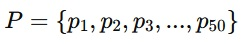{width="2.5520833333333335in"
> height="0.4583333333333333in"}
>
> Each player has a performance score:
>
> 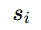{width="0.4270833333333333in"
> height="0.3125in"}
>
> where higher values mean:
>
> • faster\
> • stronger\
> • more skilled\
> • more valuable strategically
>
> Example:
>
> 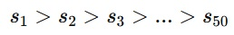{width="2.6875in"
> height="0.40625in"}
>
> So:

-   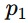{width="0.2916666666666667in"
    height="0.23958333333333334in"} = best player

-   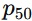{width="0.3333333333333333in"
    height="0.21875in"} = weakest player

> **Step 2 --- Normalize Talent\
> **Convert talent into a probability weight:
>
> 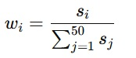{width="1.8125in"
> height="0.78125in"}
>
> This creates a distribution where the best players initially receive
> the most play time.\
> This is analogous to weighted selection systems in distributed
> algorithms.
>
> **Step 3 --- Introduce Game-Time Urgency\
> **Define:

-   {width="0.125in"
    height="0.1875in"} = current time

-   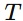{width="0.23958333333333334in"
    height="0.21875in"} = total game duration

-   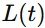{width="0.46875in"
    height="0.2916666666666667in"} = lead score margin

> As the team becomes safer (large lead and little risk), the coach
> increases fairness.\
> Define a fairness coefficient:
>
> 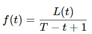{width="1.9791666666666667in"
> height="0.75in"}
>
> Interpretation:
>
> • **[large lead]{.underline}** → more substitutions\
> • **[less remaining time]{.underline}** → urgency to let everyone play
>
> **Step 4 --- Dynamic Play-Time Allocation\
> **Now we combine merit and fairness.**\
> **Define player utilization probability:
>
> 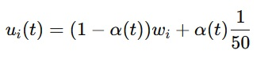{width="3.5208333333333335in"
> height="0.7604166666666666in"}
>
> where:
>
> 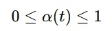{width="1.6979166666666667in"
> height="0.46875in"}
>
> and:

-   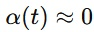{width="0.8233902012248469in"
    height="0.28030293088363956in"} early in a close game

-   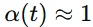{width="0.808924978127734in"
    height="0.2348490813648294in"} late in a blowout

> This equation says:

-   Early game: coach strongly favors elite players

-   Late game: distribution approaches equal opportunity

> **Step 5 --- Guarantee Everyone Plays\
> **To guarantee every player enters before the clock expires:\
> Define cumulative play participation:
>
> 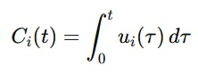{width="2.3125in"
> height="0.8645833333333334in"}
>
> Constraint:
>
> 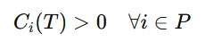{width="2.40625in"
> height="0.5833333333333334in"}
>
> Meaning:\
> Every player must receive nonzero play time before game ends.
>
> **Step 6 --- Compact Representation\
> **Here's a more compact formulation:
>
> 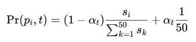{width="4.145833333333333in"
> height="0.8958333333333334in"}
>
> subject to:
>
> 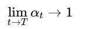{width="1.53125in"
> height="0.53125in"}
>
> and:
>
> 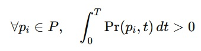{width="3.53125in"
> height="0.90625in"}
>
> **Interpretation in Plain English**
>
> This says:\
> The coach initially plays the best athletes most often.\
> As victory becomes more certain and the clock winds down:\
> • selection becomes more evenly distributed.\
> Eventually every player receives field time before the game ends.
>
> **Visually Similar Mathematical Block\
> **Here is the core scheduling equation in a clean technical style:
>
> 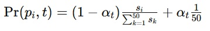{width="3.7395833333333335in"
> height="0.5520833333333334in"}
>
> And the fairness guarantee:
>
> 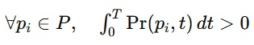{width="3.28125in"
> height="0.5833333333333334in"}
>
> **Conceptually, This Algorithm Represents\
> **A hybrid of:\
> • weighted priority scheduling\
> • probabilistic resource allocation\
> • fairness convergence\
> • dynamic load-balancing\
> • diminishing urgency optimization
>
> In computer science terms, it resembles:\
> • weighted round robin\
> • softmax scheduling\
> • proof-of-stake weighting\
> • adaptive fairness algorithms
>
> This algorithmic logic is implemented in the system to ensure an
> automated fair settlement protocol for all merchants onboarded on all
> nodes worldwide, regardless of the scale of the system, in which this
> function will continue in perpetuity.

14. **Conclusion**

> There are predictions that in the next few years, virtually all
> transactions will be on blockchain. \[13\] This is because traditional
> financial intermediaries were never designed to be
> agentic-AI-swarm-resistant or quantum-computing-resistant. For the
> first time in history, we live in a digitally interconnected age of
> the convergence of automation, AI, quantum, tokenization,
> cryptographically secured distributed ledger blockchain technologies
> and autonomous finance which cannot scale on traditional settlement
> rails, and this convergence forecasts impending change.
>
> Patent-pending and open-source technologies, centered around
> automation, AI and second-layer protocol blockchain transaction
> technology, should be embraced, because this change appears
> inevitable. Change can be difficult, but when value itself becomes
> worldwide, instant, programmable, self-custodial and interoperable,
> then architects of this transition may help shape the financial and
> transactional landscape. Translated to today's language, Niccolo
> Machiavelli \[14\] explained why change can be so hard: "The innovator
> makes enemies of everyone who did well under the old order and wins
> only lukewarm defenders among those who might benefit from the new."
>
> This world has entered an era where traditional financial transactions
> are becoming comparatively far less energy-efficient and obsolete as
> AI, automation, and quantum-era technologies converge toward a
> cryptographically-secure, blockchain-based financial future. The
> innovative system described herein provides the incentive,
> transparency, inclusion, equity, robustness, scalability,
> high-availability, redundancy, speed, self-sovereignty, privacy,
> security and ease-of-use merchants will demand in this new era.
>
> **References**
>
> \[1\] Satoshi Nakamoto, Bitcoin: A Peer-to-Peer Electronic Cash
> System, <https://bitcoin.org/en/bitcoin-paper> , October 31, 2008
>
> \[2\] STARLINK® <https://starlink.com/> , A division of SpaceX,
> [spacex.com](http://www.spacex.com) , Copyright 2026
>
> \[3\] Francesca Portoso, Which Countries Are Leading the Cashless
> Society Race,
> <https://zimpler.com/blog/which-countries-are-leading-the-cashless-society-race/>
> , October 14, 2024
>
> \[4\] USDT Tether <https://tether.to/en/whitepaper/> , Copyright 2013
> -- 2026
>
> \[5\] Bolt cards <https://theboltcard.com/> , Copyright 2022
>
> \[6\] Coolwallet® <https://www.coolwallet.io/> , Copyright 2026
>
> \[7\] Arculus® <https://www.getarculus.com/> , Copyright 2026
>
> \[8\] Coinplus® <https://coinplus.com/> , Copyright 2025
>
> \[9\] Tangem® <https://tangem.com/> , Copyright 2026
>
> \[10\] BitWisdom AI Network^TM^ License Agreement
> <https://bitwisdom.ai/license-agreement> , Copyright 2026
>
> \[11\] Intel® Processors, [www.intel.com](http://www.intel.com) ,
> Copyright 2026
>
> \[12\] nodeFÔN^TM^, [nodeFON.com](http://www.nodeFON.com) , Copyright
> 2026
>
> \[13\] Future of Blockchain: 7 Predictions for the Next Decade,
> <https://www.chaintech.network/blog/future-of-blockchain-7-predictions-for-the-next-decade/>
> , November 05, 2024
>
> \[14\] Niccolò Machiavelli,
> <https://quotefancy.com/quote/973407/Niccol-Machiavelli-The-innovator-has-for-enemies-all-who-have-done-well-under-the-old-and>
> , 1513 A.D.
>
> © 2026 BitWisdom Ai Network^TM^, LaLuz, LLC,
> [www.bitwisdom.ai](http://www.bitwisdom.ai) . All rights reserved.
